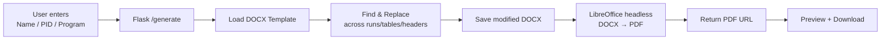

<p align="center">
  <strong style="font-size: 3rem; letter-spacing: 0.04em;">ADS</strong>
</p>

<h1 align="center">Assignment Document System</h1>

<p align="center">
  <em>Generate personalized assignment documents with one click — pixel-perfect PDF output.</em>
</p>

<p align="center">
  
  
  
  
  
</p>

---

## ✨ Overview

**ADS** is a web application that generates personalized statistics assignment documents. Students enter their **Name**, **PID**, and **Program** — the system replaces the "Submitted By" details in a DOCX template and generates a pixel-perfect PDF for instant download and preview.

### Key Features

| Feature | Description |
|---------|-------------|
| 🎨 **Premium UI** | Immersive 3D space waveform background with Three.js, glassmorphism cards, and smooth micro-animations |
| ✍️ **Handwritten Signature** | Transparent SVG signature watermark floating in the background space with pen-like flourishes |
| 🌈 **Colorful Tagline** | Stylus handwriting typewriter effect cycling through Pale Green, Royal Blue, and Cadbury Maroon |
| 📄 **Smart Document Generation** | DOCX template find-and-replace with cross-run text handling that preserves original formatting |
| 📑 **Live PDF Preview** | In-browser PDF preview with iframe rendering after generation |
| 💾 **Auto-save Credentials** | LocalStorage persistence remembers your details across sessions |
| 🐳 **Docker + Render** | One-command deployment with Docker and Render support |
| 🔤 **Microsoft Fonts** | Uses Segoe UI, Ink Free, and Segoe Script — built-in Windows fonts, no external CDN required |

---

## 🏗️ Architecture

```
ads-assignment-system/
├── app.py                  # Flask backend — routes, DOCX processing, PDF conversion
├── templates/
│   └── index.html          # Single-page frontend — Three.js + glass UI + tagline animation
├── documents/
│   ├── FINAL_SATS_ASS.docx # DOCX template (add your own)
│   ├── settings.json       # Placeholder text configuration
│   └── settings.example.json
├── generated/              # Auto-created output directory (gitignored)
├── Dockerfile              # Production Docker image with LibreOffice
├── requirements.txt        # Python dependencies
├── .gitignore
└── README.md
```

### How It Works



1. **Template Loading** — The system finds the DOCX template in `documents/` (configurable via `settings.json`)
2. **Smart Replace** — Text replacement works across Word "runs" (split formatting), tables, headers, and footers
3. **PDF Conversion** — LibreOffice headless converts DOCX to PDF, preserving all original formatting
4. **Cleanup** — Generated files older than 30 minutes are auto-cleaned on each page visit

---

## 🚀 Quick Start

### Prerequisites

- **Python 3.11+**
- **LibreOffice** (for PDF generation) — or use Docker which includes it

### Local Development

```bash
# Clone the repository
git clone https://github.com/melody-in/ads-assignment-system.git
cd ads-assignment-system

# Install dependencies
pip install -r requirements.txt

# Place your DOCX template in documents/
# Configure documents/settings.json with your placeholder text

# Run the server
python app.py
```

Then visit **http://localhost:5000**

### Docker (Recommended)

```bash
# Build the image
docker build -t ads-system .

# Run the container
docker run -p 5000:5000 ads-system
```

Then visit **http://localhost:5000**

---

## ⚙️ Configuration

### `documents/settings.json`

This file defines what placeholder text to search for in the template:

```json
{
  "template": "FINAL_SATS_ASS.docx",
  "findName": "N. Akshit Vinay",
  "findPid": "25MSRSGIS001",
  "findCourse": "M.Sc.  Remote Sensing & Gis"
}
```

| Key | Description |
|-----|-------------|
| `template` | Filename of the DOCX template in `documents/` |
| `findName` | The name text to find and replace |
| `findPid` | The PID text to find and replace |
| `findCourse` | The course/program text to find and replace |

> **Tip:** If `template` is empty or missing, the system will auto-detect the most recently modified `.docx` file in `documents/`.

---

## 🎨 Design & UI

### Font System

ADS uses **Microsoft system fonts** that ship with Windows — zero external font loading:

| Usage | Font | Fallback |
|-------|------|----------|
| Body / UI | `Segoe UI` | Calibri, Trebuchet MS, Arial |
| Signature watermark | `Ink Free`, `Segoe Script` | Bradley Hand ITC, cursive |
| Tagline typing | `Ink Free`, `Segoe Script` | Bradley Hand ITC, cursive |
| Logo | `Segoe UI` (bold) | Calibri |

### Tagline Animation

The tagline **"Together, no one walks alone"** types character-by-character in stylus handwriting:

- **Speed**: ~220–380ms per character (natural, human-like cadence)
- **Colors**: Each character cycles through **Pale Green → Royal Blue → Cadbury Maroon**
- **Lifecycle**: Type → Hold 6s → Fade out (staggered) → Pause 3s → Fresh restart
- **Effects**: Cloud-like glow (`text-shadow`) on each character

### Signature Watermark

- Rendered as **transparent SVG** in the background space (z-index between 3D canvas and UI)
- Uses handwriting font with an italic pen-flourish underline
- **12% opacity** — visible but non-intrusive
- Gradient colors matching the tagline palette

### 3D Background

- **Three.js WebGL** with Fibonacci spiral + hexagonal standing wave shaders
- Mouse-reactive wave deformation with ripple effects on click/touch
- 2000 star particles with additive blending
- 30 floating hexagonal/pentagonal shapes

---

## 🌐 Deployment

### Deploy to Render

1. Push this repo to GitHub
2. Go to [Render Dashboard](https://dashboard.render.com)
3. Click **New → Web Service**
4. Connect this GitHub repo
5. Set **Environment** to **Docker**
6. Deploy — done!

### Health Check

ADS provides a `/health` endpoint for monitoring:

```bash
curl https://your-app.onrender.com/health
# → {"status":"ok","template_found":true,"template_name":"FINAL_SATS_ASS.docx"}
```

### Template Status

Check template and settings configuration:

```bash
curl https://your-app.onrender.com/template-status
```

---

## 📡 API Endpoints

| Method | Endpoint | Description |
|--------|----------|-------------|
| `GET` | `/` | Serve the main UI |
| `GET` | `/health` | Health check — template status |
| `GET` | `/template-status` | Full settings + template info |
| `POST` | `/generate` | Generate assignment (JSON body) |
| `GET` | `/preview-pdf/<id>` | Inline PDF preview |
| `GET` | `/download-pdf/<id>` | Download PDF attachment |

### Generate Request

```bash
curl -X POST http://localhost:5000/generate \
  -H "Content-Type: application/json" \
  -d '{"studentName":"John Doe","studentPid":"25ABC001","studentCourse":"M.Sc. Data Science"}'
```

### Generate Response

```json
{
  "success": true,
  "pdfUrl": "/download-pdf/a1b2c3d4e5f6",
  "previewUrl": "/preview-pdf/a1b2c3d4e5f6",
  "pdfReady": true,
  "studentName": "John Doe",
  "studentPid": "25ABC001",
  "studentCourse": "M.Sc. Data Science"
}
```

---

## 🛠️ Tech Stack

| Layer | Technology |
|-------|-----------|
| **Backend** | Python 3.11 / Flask 3.1.3 |
| **DOCX Processing** | python-docx 1.2.0 |
| **PDF Conversion** | LibreOffice (headless mode) |
| **Frontend** | Vanilla HTML/CSS/JS |
| **3D Background** | Three.js r128 (WebGL shaders) |
| **WSGI Server** | Gunicorn 23.0.0 |
| **Containerization** | Docker (python:3.11-slim + LibreOffice) |
| **Hosting** | Render (Docker environment) |

---

## 📝 License

This project is for educational use within the university assignment system.

---

<p align="center">
  <em>Built with ♥ by VIR@HITVIN</em>
</p>
